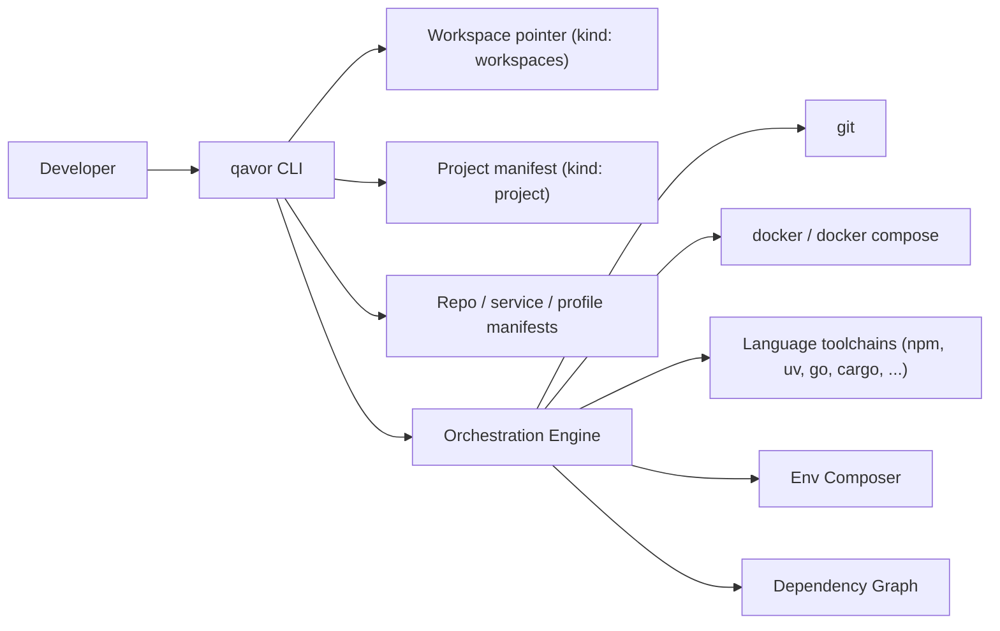

# Qavor — Product Proposal (Draft v0)

A CLI for managing a constellation of related repositories as one cohesive developer workspace.

> Status: **Draft v0** — for review.
> Companion documents: [manifests.md](./manifests.md) (manifest reference & source of truth), [decisions.md](./decisions.md), [mvp-tasks.md](./mvp-tasks.md), [schemas/](./schemas/).

---

## 1. Problem & Vision

Modern product teams routinely span 5–50+ repositories: services, libraries, infra, data jobs, web apps. Onboarding and day-to-day work require chaining `git`, `docker compose`, multiple language toolchains, custom shell scripts, and tribal knowledge — and breaks the moment one repo is missing or misconfigured.

**Vision.** `qavor` is a single CLI that lets a developer go from a fresh laptop to a fully running multi-service workspace with one command, and then perform routine multi-repo operations (sync, status, commit, push, run, build, restart) as first-class verbs.

**Positioning.** Lean wrapper. `qavor` owns the declarative model, the dependency graph, environment composition, and the orchestration loop. It shells out for everything else: `git`, `docker`/`docker compose`, `npm`/`pnpm`/`uv`/`pip`/`go`/`cargo`/etc.

---

## 2. Goals & Non-Goals

**Goals**
- One command to clone, prepare, and run a defined workspace.
- Per-repo declarative manifests with a discriminated `kind:` model; no monolithic meta-repo required.
- Uniform UX across git, dependency prep, backing deps, native run, container build/run.
- Composable env vars with clear precedence and dependency-aware propagation.
- Selective ops: by repo, by group, by tag, by service.
- Deterministic, scriptable, CI-friendly.

**Non-Goals (v1)**
- Replacing CI/CD, deployment, or production orchestration (no K8s, no Helm).
- Replacing IDE/devcontainer features.
- Implementing our own container runtime, package manager, or process supervisor from scratch.
- Cross-team/remote shared workspaces (single-developer local first).

---

## 3. Architecture Position



`qavor` is stateless apart from a small local cache (resolved env, last-known repo states, lockfile hashes). All source-of-truth lives in versioned manifest files.

---

## 4. Core Concepts (vocabulary)

`qavor` uses a single discriminated manifest model. Every YAML document carries a top-level `kind:` field that selects which schema and which orchestration semantics apply. See [manifests.md](./manifests.md) for the canonical examples.

- **Workspace** — a directory containing all cloned repos plus a small `.qavor/` state folder. The workspace dir itself is not a git repo.
- **Workspaces manifest** (`kind: workspaces`) — single-line pointer file at the workspace root. Generated by `qavor init`. Just identifies the project repo.
- **Project repo** — the seed git repo whose root holds the **project manifest** (`kind: project`). Defines the workspace identity and is the single source of truth for the list of repos in the workspace. No other manifest kind contributes repos to the workspace.
- **Service manifest** (`kind: service`) — a runnable application: how to build and execute an app. Lives at the repo root (single-service repo) or under a sub-directory (multi-service repo). A repo may contain zero, one, or many services, and a service manifest never alters the workspace repo set.
- **Backing service** — a `kind: service` for an externally provided backing dep (postgres, kafka, redis, …). It typically runs via `docker-compose` (per ADR-005) and declares an `env.publish` contract; nothing but those published vars flows to its dependents.
- **Profile manifest** (`kind: profile`) — reusable runtime + env bundle, referenced from service manifests via a `profiles:` list.
- **Group** — labelled set of repos / services (e.g., `frontend`, `data`, `auth-stack`). A repo may belong to multiple.
- **Run mode** — `native`, `docker`, or `docker-compose` per service (the last typical for backing services). Overridable per invocation via `--mode`.

**On-disk layout** (canonical example):

```
- workspace-dir/                        # not a git repo
  - qavor.yaml                          # kind: workspaces
  - project-repo.git/
    - qavor.yaml                        # kind: project
  - service-repo-1.git/
    - qavor.yaml                        # kind: service
  - service-repo-2.git/
    - qavor.yaml                        # kind: service
  - multi-service-repo.git/
    - service-foo/qavor.yaml            # kind: service
    - service-bar/qavor.yaml            # kind: service
  - backing-deps.git/
    - postgresql/qavor.yaml             # kind: service (backing)
    - kafka/qavor.yaml                  # kind: service (backing)
```

A repo may put all its manifests in a single multi-document `qavor.yaml` (separated by `---`) or split them under a `qavor/` sub-directory; both forms can mix kinds freely.

---

## 5. Requirements — Evaluation + Proposed Additions

For each category below: items already in the original brief are marked **(existing)**; new proposals are marked **(new)**.

### 5.1 Repo Management

- (existing) Clone all project repos
- (existing) Group repos by categories
- (existing) Sync / commit / push / status across all, selected, or grouped repos
- (new) **Project-repo bootstrap** — `qavor init <project-repo-url>` clones the project repo, generates the workspace pointer (`kind: workspaces`), then reads the project manifest and clones the rest. Resolves the cold-start problem without a separate bootstrap file.
- (new) **Branch ops across repos** — create / switch / delete / list branches with a single selector; useful for feature work spanning repos.
- (new) **Filtered selectors** — `--group`, `--repo`, `--tag`, plus state filters (`--dirty`, `--ahead`, `--behind`).
- (new) **Aggregated status view** — single-screen summary: branch, ahead/behind, dirty files, last commit, group.
- (new) **Parallel execution with per-repo progress** — bounded concurrency, structured output, no interleaved noise.
- (new) **PR / tag / release helpers** — thin wrappers over `gh` (or equivalent) for create-PR-across-repos and coordinated tagging.
- (new) **Stash & cleanup** — `qavor stash`, `qavor clean` (purge build artifacts, caches, optionally untracked).
- (new) **Auth model** — explicitly delegate to user's git credential helpers / SSH; document SSH-vs-HTTPS choice.

### 5.2 Repo Preparation (dependencies)

- (existing) Prepare node / python / uv dependencies
- (new) **Per-runtime steps in the manifest** — reserved lifecycle keys `runtime.<backend>.{ check_installed, install, run }` plus any number of **user-defined commands** (e.g. `prepare`, `update_libraries`, `lint`). Each command is discovered and run on demand as `qavor <command>`; qavor assumes no fixed command set. A typical `prepare` command encapsulates whatever the language toolchain needs (`uv sync`, `pnpm install --frozen-lockfile`, `cargo fetch`, …).
- (new) **Profiles for reuse** — common prepare/run recipes (e.g. `python_application`, `node_application`) live in profile manifests and are referenced by services. A `profiles:` entry may reference a profile by name (local) or by a **remote source** — https / GitHub / git / `file://` — so a curated profile can be shared across workspaces; the remote profile is fetched, optionally sha256-pinned, cached under `~/.cache/qavor/`, and resolved by name at registry-build time (ADR-007). `--offline` uses the cache only; `--refresh` re-fetches.
- (new) **Toolchain version management** — detect & delegate to `mise`/`asdf` if present; otherwise warn through `qavor doctor`.
- (new) **Lockfile-aware skip** — hash declared lockfile inputs to skip `prepare` when unchanged (massive ergonomic win).
- (new) **Code generation step** — model as a profile or a `prepare` step that runs `buf generate`, OpenAPI generators, etc., before `run`.
- (new) **Pre-flight check** — `qavor doctor` verifies required tools, versions, container runtime, disk space, and runs each runtime backend's `check_installed`.
- (new) **Custom hook scripts** — `pre_command` / `post_command` on the `hooks:` block, fired around every `qavor <command>` run with `QAVOR_COMMAND` set.
- (new) **Parallel prepare across repos** with shared progress.

### 5.3 Backing Services (stateful dependencies)

A backing service is a `kind: service` for an externally provided dependency. It is
distinguished only by how it runs (typically `mode: docker-compose`) and by declaring an
`env.publish` contract.

- (existing) Bringup of postgres / mysql / kafka / etc.
- (new) **Backed by docker compose** under the hood — `qavor` generates and owns the compose project (per ADR-005) from backing-service documents (`mode: docker-compose`).
- (new) **Versioned and pinned** — image versions live in the manifest's `runtime.docker-compose.run.cmd` or in env (e.g. `POSTGRES_IMAGE: postgres:16.3`).
- (new) **Health checks / readiness gating** — dependents only start once probes pass (configured on the runtime backend).
- (new) **Connection info exposure** — the `env.publish:` map is the explicit contract of vars exposed to dependents (`POSTGRES_HOST`, `POSTGRES_PORT`, `POSTGRES_URL`).
- (new) **Volumes, seed data, migrations** — declared via the runtime backend; one-shot scripts attach as `pre_run` / `post_run` hooks.
- (new) **Reset / recreate / snapshot / restore** — `qavor backing reset postgres`, optional snapshot for fast rewinds.
- (new) **Auto port allocation** — avoid conflicts when multiple workspaces coexist.
- (new) **Multiple instances** — e.g., a `postgres-app` backing service and a separate `postgres-test` one.

### 5.4 Service Execution

- (existing) Run sets of services (python/node/go/...)
- (existing) Build docker images for each service
- (existing) Run the same services in containers
- (new) **Process supervision** — start/stop/restart/status as first-class verbs; track PIDs in `.qavor/`.
- (new) **Run modes** — `native` or `docker` per service, switchable per invocation (`--mode docker`).
- (new) **Startup ordering from dep graph** — topological start over `require:` edges, parallel where possible.
- (new) **Health/readiness probes** — HTTP, TCP, command — gate dependents and report status (configured per runtime backend).
- (new) **Log aggregation** — colored, prefixed tail of all running services; `qavor logs <service>` for one.
- (new) **Hot reload hooks** — declarative `watch:` patterns + restart command (delegate to native watchers, not reinvent).
- (new) **Debug mode** — port-forward debugger ports, set `*_DEBUG` env, attach instructions.
- (new) **Graceful shutdown** — SIGTERM, configurable grace period, then SIGKILL.
- (new) **Container build conventions** — image name templating (`{registry}/{repo}/{service}:{git_sha}`) configured via env (`IMAGE_NAME`); BuildKit cache reuse; optional registry push.
- (new) **Selective run** — by group, by service, by tag, with `--with-deps`/`--no-deps` toggles.

### 5.5 Environment Variable Management

- (existing) Per-service and per-backing-dep env vars
- (existing) YAML-defined env
- (existing) `.env` overrides
- (existing) Platform-specific (native vs docker)
- (new) **Layered env block** — every service / profile manifest has `env: { common, native, docker }`. `common` always applies; `native` or `docker` is layered on top depending on the active mode.
- (new) **Publish contract** — a backing service adds `env.publish:`, the only vars that flow to dependents.
- (new) **Explicit precedence** — defined in §6 below; identical for every service at every layer.
- (new) **Interpolation & references** — `${POSTGRES_HOST}`, `${secret:DB_PASSWORD}`. Cross-service references use the backing service's `publish` map rather than ad-hoc lookups.
- (new) **Validation / schema** — `required: true`, types, regex; fail fast at start (long-form `envSpec`).
- (new) **Profiles** — reusable env layered below the manifest's own env; chainable.
- (new) **Inspect resolved env** — `qavor env <service>` shows fully-resolved values with provenance (which file/layer set each var).
- (new) **Secrets handling** — pluggable provider interface (1Password, sops, vault, env-only); never check secrets into manifests.

### 5.6 Cross-Service Dependencies

- (existing) Services declare dependencies on other services and backing deps
- (existing) Env vars from deps propagate across the chain (via a backing service's `publish`)
- (new) **Cross-repo dependencies** — service in repo A can require a service in repo B by name (`{ service: token-issuer }`); resolved through the workspace registry.
- (new) **Cycle detection** at validation time with a clear error.
- (new) **Optional/conditional deps** — gated by profile, mode, or platform via `optional:` / `condition:`.
- (new) **"Wait for" semantics** tied to readiness probes via `waitFor: ready`.
- (new) **Graph visualization** — `qavor graph` outputs mermaid/dot for onboarding & debugging.
- (new) **Group-level dependencies** — `frontend` group depends on `auth-stack` group.

### 5.7 Proposed New Categories

**A. Workspace & Bootstrap** — fills the cold-start gap.
- `qavor init <project-repo-url-or-path>` — clones the project repo, writes the `kind: workspaces` pointer, then clones the listed repos.
- Multiple workspaces side-by-side; switch via `qavor workspace use <name>`.

**B. Lifecycle Hooks & Custom Tasks**
- `pre`/`post` hooks on key verbs via the `hooks:` block on repo / service manifests.
- User-defined tasks declared in a `kind: profile` or alongside services and runnable as `qavor run <name>:<task>` (post-MVP).

**C. Diagnostics**
- `qavor doctor` (toolchain prereqs, runtime checks, runs each runtime's `check_installed`).
- `qavor status` (aggregated repo + service health dashboard).
- `qavor explain <service>` (resolved config, env, deps, run command — with provenance).

**D. Logging & Observability (lightweight)**
- Centralized tail with prefixes; rotation; per-service log files.
- Optional structured-log pretty-printing.

**E. Documentation Generation**
- `qavor docs` renders the workspace catalog (repos, services, backing deps, env contracts) as markdown — great for onboarding READMEs.

**F. Extensibility (post-MVP)**
- Plugin interface for new language adapters (delivered as profile bundles), secret providers, container backends (Podman/OrbStack).

---

## 6. Manifest Resolution Order (env precedence)

When the same env key is set in multiple places, **later layers win**. For a given service invocation in a given mode, qavor composes env top-down:

1. **Required dependencies** (from each required service, recursively):
   1. `env.common` from the dep's `qavor.yaml`
   2. `env.native` or `env.docker` (depending on the dep's active mode)
   3. `.env` next to the dep's `qavor.yaml`
   4. `.env.native` or `.env.docker` (depending on mode), next to the dep's `qavor.yaml`
   - When a dep declares `env.publish` (a backing service), only that contract is forwarded to dependents.
2. **The service itself**:
   1. `env.common` from its own `qavor.yaml` (with profiles already merged in below it)
   2. `env.native` or `env.docker` (depending on the active mode)
   3. `.env` next to its `qavor.yaml`
   4. `.env.native` or `.env.docker` (depending on mode), next to its `qavor.yaml`
3. **Workspace `.env`** (at the workspace root, alongside the `kind: workspaces` pointer)
4. **CLI** `--env KEY=VAL`

Profiles attached to a service are resolved before step 2 — each profile's own `env.common`/`env.native`/`env.docker` is layered in the order profiles are declared (later profiles win), and the manifest's own env wins over all of them.

`qavor env <service>` prints the fully-resolved value with provenance for each key, so this chain is always inspectable.

---

## 7. Manifest Examples

The full set of canonical examples lives in [manifests.md](./manifests.md). The condensed sketches below show the shape of each `kind:`.

**Workspaces pointer** (generated by `qavor init`, lives at the workspace root):

```yaml
kind: workspaces
root_project_path: ./project-repo.git
```

**Project manifest** (at the project repo root):

```yaml
kind: project
name: acme-platform
git:
  root_url: https://github.com/rubenhak
  repo_prefix: acme-
  default_branch: main
repositories:
  - web
  - app
  - db
```

**Service manifest** (at a service repo root, or under a sub-directory of a multi-service repo):

```yaml
kind: service
name: auth
groups: [backend]

profiles: [python_application]

runtime:
  native:
    enabled: true
    check_installed: { cmd: "uv --version" }
    install:         { cmd: "echo 'install uv first' && exit 1" }
    prepare:         { cmd: "uv sync --all-extras" }
    run:             { cmd: "uv run uvicorn app.main:app --port ${PORT}" }
  docker:
    enabled: true
    check_installed: { cmd: "docker --version" }
    prepare:         { cmd: "docker build -t ${IMAGE_NAME} ." }
    run:             { cmd: "docker run -it --rm ${IMAGE_NAME}" }

mode: native

require:
  - service: postgres
  - service: token-issuer

env:
  common: { PORT: 8080, LOG_LEVEL: info }
  native: { LOG_FORMAT: text }
  docker: { IMAGE_NAME: auth-service, LOG_LEVEL: warn, LOG_FORMAT: json }
```

**Backing service manifest** (under a sub-directory of a deps repo, or at a single-service repo root):

```yaml
kind: service
name: postgres
groups: [database]

mode: docker-compose
runtime:
  docker-compose:
    enabled: true

hooks:
  pre_run:  [ ./pre-run.sh ]
  post_run: [ ./post-run.sh ]

env:
  common: { POSTGRES_DB: auth, POSTGRES_USER: auth, POSTGRES_PASSWORD: "${secret:PG_PW}" }
  native: { POSTGRES_HOST: localhost,    POSTGRES_PORT: 1234 }
  docker: { POSTGRES_HOST: mypostgresql, POSTGRES_PORT: 5432 }

  publish:
    POSTGRES_HOST: "${POSTGRES_HOST}"
    POSTGRES_PORT: "${POSTGRES_PORT}"
    POSTGRES_URL:  "postgres://auth:${secret:PG_PW}@${POSTGRES_HOST}:${POSTGRES_PORT}/auth"
```

**Profile manifest** (referenced by services via `profiles:`):

```yaml
kind: profile
name: python_application

runtime:
  native:
    enabled: true
    check_installed: { cmd: "uv --version" }
    prepare:         { cmd: "uv sync --all-extras" }
    run:             { cmd: "uv run uvicorn app.main:app --port ${PORT}" }
  docker:
    enabled: true
    check_installed: { cmd: "docker --version" }
    prepare:         { cmd: "docker build -t ${IMAGE_NAME} ." }
    run:             { cmd: "docker run -it --rm ${IMAGE_NAME}" }

mode: native

env:
  common: { LOG_LEVEL: info }
```

> Formal JSON Schemas live in [`schemas/`](./schemas/) — one per kind, plus a master dispatcher [`qavor.schema.json`](./schemas/qavor.schema.json).

---

## 8. CLI Surface (illustrative)

- `qavor init <project-repo-url-or-path>`, `qavor workspace ...`
- `qavor git clone | sync | status | commit | push | branch | pr` (all accept selectors)
- `qavor <command>` (any manifest-defined runtime command, e.g. `qavor prepare`, `qavor update_libraries`), `qavor commands` (list them), `qavor doctor`
- `qavor up`, `qavor down`, `qavor restart`, `qavor logs`, `qavor ps`
- `qavor build`, `qavor run`
- `qavor backing up|down|reset|snapshot|restore` (backing services)
- `qavor env <service>`, `qavor explain <service>`, `qavor graph`
- `qavor docs`

---

## 9. Open Decisions (resolved)

The six original open questions are resolved in [decisions.md](./decisions.md):

- **ADR-001** Implementation language → Node.js (TypeScript), Node 26+, distributed as a Single Executable Application. Asynchronous APIs throughout; all parallel fan-out is bounded (default `os.availableParallelism()`, override `--jobs N`).
- **ADR-002** Process supervision → own minimal native supervisor + compose for containers / backing services.
- **ADR-003** Container runtime → Docker only at v0; pluggable later.
- **ADR-004** Bootstrap → project-repo seeded; `qavor init <project-repo-url>` writes the `kind: workspaces` pointer.
- **ADR-005** Compose file ownership → generate-and-own with overlay overrides.
- **ADR-006** State directory → per-workspace `./.qavor/` + global `~/.cache/qavor/`.

---

## 10. Success Metrics

- Time from fresh laptop to running stack — target **< 15 minutes** (vs hours today).
- Lines of bespoke shell/README/Makefile scripting eliminated per onboarded repo.
- Number of repos a single developer can routinely operate on without context loss.
- Drift incidents (env mismatches, missing deps) per month — should trend to zero.
