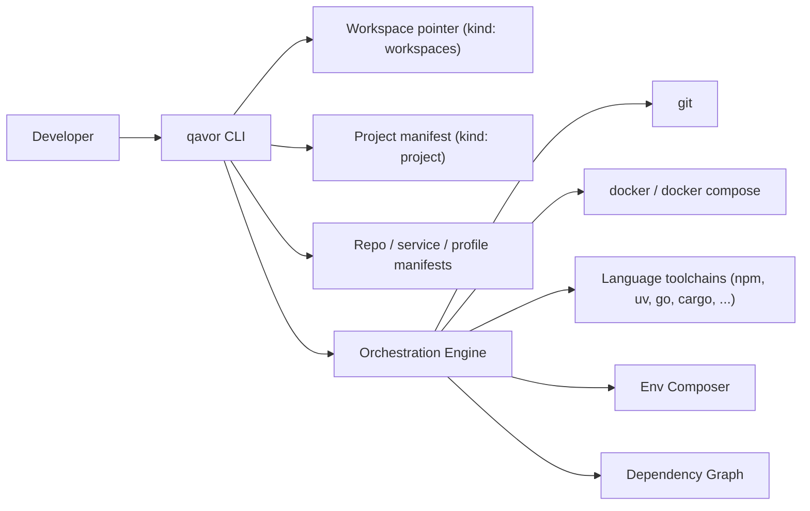

# Qavor — Product Proposal

A CLI for managing a constellation of related repositories as one cohesive developer workspace.

> Status: **partially implemented.** This document remains the north-star vision.
> The MVP has shipped and several later items have landed; the rest is on the
> roadmap. Each requirement in §5 is tagged with its current state — see the
> legend in [§0](#0-implementation-status). For the always-current summary, see
> the [README](../README.md) *Implementation status* section and
> [mvp-tasks.md](./mvp-tasks.md).
> Companion documents: [manifests.md](./manifests.md) (manifest reference & source of truth), [decisions.md](./decisions.md), [mvp-tasks.md](./mvp-tasks.md), [schemas/](./schemas/).

---

## 0. Implementation status

The vision below was written before implementation. Requirements in §5 now carry
a status tag so the proposal doubles as a scorecard:

- ✅ **done** — implemented and shipped.
- 🟡 **partial** — the mechanism exists but is limited (e.g. contract composes but
  is not yet executed at runtime).
- ⬜ **planned** — designed here, not yet built.

**Roughly where things stand:** workspace bootstrap, the full manifest model,
git fan-out, env composition (including `require:` deps and `env.publish`
contracts), profiles (local + remote, chaining, merge directives), dynamic
manifest commands, and native process supervision are **done**. Container
execution (`mode: docker` / `docker-compose`), backing-service *bring-up*,
`${secret:...}`, the runtime dependency graph (topological start / readiness),
group & tag selectors, and the `graph` / `explain` / `docs` introspection verbs
are **planned**. See [mvp-tasks.md](./mvp-tasks.md#roadmap-not-yet-implemented)
for the ordered roadmap.

---

## 1. Problem & Vision

Modern product teams routinely span 5–50+ repositories: services, libraries, infra, data jobs, web apps. Onboarding and day-to-day work require chaining `git`, `docker compose`, multiple language toolchains, custom shell scripts, and tribal knowledge — and breaks the moment one repo is missing or misconfigured.

**Vision.** `qavor` is a single CLI that lets a developer go from a fresh laptop to a fully running multi-service workspace with one command, and then perform routine multi-repo operations (sync, status, commit, push, run, build, restart) as first-class verbs.

**Positioning.** Lean wrapper. `qavor` owns the declarative model, the dependency graph, environment composition, and the orchestration loop. It shells out for everything else: `git`, `docker`/`docker compose`, `npm`/`pnpm`/`uv`/`pip`/`go`/`cargo`/etc.

---

## 2. Goals & Non-Goals

**Goals**
- One command to clone, prepare, and run a defined workspace.
- Per-repo declarative manifests with a discriminated `kind:` model; no monolithic meta-repo required.
- Uniform UX across git, dependency prep, backing deps, native run, container build/run.
- Composable env vars with clear precedence and dependency-aware propagation.
- Selective ops: by repo, by group, by tag, by service.
- Deterministic, scriptable, CI-friendly.

**Non-Goals (v1)**
- Replacing CI/CD, deployment, or production orchestration (no K8s, no Helm).
- Replacing IDE/devcontainer features.
- Implementing our own container runtime, package manager, or process supervisor from scratch.
- Cross-team/remote shared workspaces (single-developer local first).

---

## 3. Architecture Position



`qavor` is stateless apart from a small local cache (resolved env, last-known repo states, lockfile hashes). All source-of-truth lives in versioned manifest files.

---

## 4. Core Concepts (vocabulary)

`qavor` uses a single discriminated manifest model. Every YAML document carries a top-level `kind:` field that selects which schema and which orchestration semantics apply. See [manifests.md](./manifests.md) for the canonical examples.

- **Workspace** — a directory containing all cloned repos plus a small `.qavor/` state folder. The workspace dir itself is not a git repo.
- **Workspaces manifest** (`kind: workspaces`) — single-line pointer file at the workspace root. Generated by `qavor init`. Just identifies the project repo.
- **Project repo** — the seed git repo whose root holds the **project manifest** (`kind: project`). Defines the workspace identity and is the single source of truth for the list of repos in the workspace. No other manifest kind contributes repos to the workspace.
- **Service manifest** (`kind: service`) — a runnable application: how to build and execute an app. Lives at the repo root (single-service repo) or under a sub-directory (multi-service repo). A repo may contain zero, one, or many services, and a service manifest never alters the workspace repo set.
- **Backing service** — a `kind: service` for an externally provided backing dep (postgres, kafka, redis, …). It typically runs via `docker-compose` (per ADR-005) and declares an `env.publish` contract; nothing but those published vars flows to its dependents.
- **Profile manifest** (`kind: profile`) — reusable runtime + env bundle, referenced from service manifests via a `profiles:` list.
- **Group** — labelled set of repos / services (e.g., `frontend`, `data`, `auth-stack`). A repo may belong to multiple.
- **Run mode** — `native`, `docker`, or `docker-compose` per service (the last typical for backing services). Overridable per invocation via `--mode`.

**On-disk layout** (canonical example):

```
- workspace-dir/                        # not a git repo
  - qavor.yaml                          # kind: workspaces
  - project-repo.git/
    - qavor.yaml                        # kind: project
  - service-repo-1.git/
    - qavor.yaml                        # kind: service
  - service-repo-2.git/
    - qavor.yaml                        # kind: service
  - multi-service-repo.git/
    - service-foo/qavor.yaml            # kind: service
    - service-bar/qavor.yaml            # kind: service
  - backing-deps.git/
    - postgresql/qavor.yaml             # kind: service (backing)
    - kafka/qavor.yaml                  # kind: service (backing)
```

A repo may put all its manifests in a single multi-document `qavor.yaml` (separated by `---`) or split them under a `qavor/` sub-directory; both forms can mix kinds freely.

---

## 5. Requirements — with implementation status

Each item is tagged ✅ done · 🟡 partial · ⬜ planned (see [§0](#0-implementation-status)).

### 5.1 Repo Management

- ✅ Clone all project repos (`qavor git clone`).
- ⬜ Group repos by categories (groups not yet modeled as selectors).
- ✅ Sync / commit / push / status across all or `--only`-selected repos; ⬜ group selection.
- ✅ **Project-repo bootstrap** — `qavor init <project-repo-url>` clones the project repo, generates the workspace pointer (`kind: workspaces`), then reads the project manifest and clones the rest. Resolves the cold-start problem without a separate bootstrap file.
- ⬜ **Branch ops across repos** — create / switch / delete / list branches with a single selector.
- 🟡 **Filtered selectors** — `--only <name...>` is implemented; `--group` / `--tag` and state filters (`--dirty` / `--ahead` / `--behind`) are planned.
- ✅ **Aggregated status view** — `qavor git status` renders a live table: branch, ahead/behind, dirty files, last commit (optional GitHub visibility).
- ✅ **Parallel execution with per-repo progress** — bounded concurrency, live per-repo rows, no interleaved noise.
- ⬜ **PR / tag / release helpers** — thin wrappers over `gh` for create-PR-across-repos and coordinated tagging.
- ⬜ **Stash & cleanup** — `qavor stash`, `qavor clean` (purge build artifacts, caches, optionally untracked).
- ✅ **Auth model** — clone/push delegate to the user's git credential helper / SSH; remote profile sources reuse the same, with an optional bearer token for raw https/GitHub.

### 5.2 Repo Preparation (dependencies)

- ✅ Prepare node / python / uv dependencies (via a `prepare` dynamic command).
- ✅ **Per-runtime steps in the manifest** — reserved lifecycle keys `runtime.<backend>.{ check_installed, install, run }` plus any number of **user-defined commands** (e.g. `prepare`, `update_libraries`, `lint`). Each command is discovered and run on demand as `qavor <command>`; qavor assumes no fixed command set. A typical `prepare` command encapsulates whatever the language toolchain needs (`uv sync`, `pnpm install --frozen-lockfile`, `cargo fetch`, …). Every command shares one uniform shape — `{ description?, operations }`, with no structural difference between the reserved lifecycle keys and user-defined commands — where `operations` holds the actual step(s) and `description` is optional documentation-only text surfaced by `qavor commands` and `qavor <command> --help`; a service inherits a profile's description unless it sets its own.
- ✅ **Profiles for reuse** — common prepare/run recipes (e.g. `python_application`, `node_application`) live in profile manifests and are referenced by services. A `profiles:` entry may reference a profile by name (local) or by a **remote source** — https / GitHub / git / `file://` — so a curated profile can be shared across workspaces; the remote profile is fetched, optionally sha256-pinned, cached under `~/.cache/qavor/`, and resolved by name at registry-build time (ADR-007). `--offline` uses the cache only; `--refresh` re-fetches.
- ⬜ **Toolchain version management** — detect & delegate to `mise`/`asdf` if present; otherwise warn through `qavor doctor`.
- ⬜ **Lockfile-aware skip** — hash declared lockfile inputs to skip `prepare` when unchanged. (An early implementation was removed; commands currently run unconditionally.)
- ✅ **Code generation step** — expressible today as a dynamic command or a `$prepend` step before the inherited prepare steps.
- 🟡 **Pre-flight check** — `qavor doctor` verifies git, writable state/cache dirs, and runs each service's `check_installed`; container-runtime and disk-space checks are warn-only / planned.
- ✅ **Custom hook scripts** — `pre_command` / `post_command` on the `hooks:` block fire around each `qavor <command>` run with `QAVOR_COMMAND` set.
- ✅ **Parallel prepare across repos** with shared live progress.

### 5.3 Backing Services (stateful dependencies)

A backing service is a `kind: service` for an externally provided dependency. It is
distinguished only by declaring an `env.publish` contract and bringing itself up with
declarative `compose:`/`docker:` steps (ADR-008). Ready-made templates ship under
`library/` (postgresql, mysql, redisearch, kind) and are consumed via remote profile
directory sources (ADR-009) — see `library/README.md`.

- ✅ Bringup of postgres / mysql / redisearch / a kind cluster via `library/` templates; other services are expressible with the same declarative steps.
- ✅ **Backed by docker compose** under the hood — a compose file authored next to the manifest, driven by declarative `compose:` steps (`up -d --wait`, `down`, `down -v`). *ADR-005's generate-and-own compose project is superseded at step granularity by ADR-008.*
- ✅ **Versioned and pinned** — image versions live in env (e.g. `POSTGRES_IMAGE: postgres:17.5-alpine`), overridable per workspace.
- 🟡 **Health checks / readiness gating** — `up` blocks on container healthchecks (`compose up --wait` / docker health polling); *dependents-wait-for-ready graph gating is still planned* (`waitFor: ready`).
- 🟡 **Connection info exposure** — the `env.publish:` map composes into dependents' env (`qavor resolve-env`); it is not yet injected into dependents' `qavor <command>` runs automatically.
- 🟡 **Volumes, seed data, migrations** — named volumes are owned by the compose project (`down` keeps them, `purge` wipes them); seed/migrate via ordinary manifest commands or `$append` steps on `up`. `pre_run` / `post_run` hooks still do not fire.
- ⬜ **Reset / recreate / snapshot / restore** — `qavor backing reset postgres`, optional snapshot for fast rewinds.
- ⬜ **Auto port allocation** — avoid conflicts when multiple workspaces coexist (ports are env-parametrized; allocation is manual).
- ✅ **Multiple instances** — two stubs referencing the same library template with different `*_INSTANCE`/port values yield independent instances.

### 5.4 Service Execution

- 🟡 Run services natively (✅ in the foreground via `qavor run`, a plain manifest command); running *sets* with graph ordering is planned.
- ⬜ Build docker images for each service.
- ⬜ Run the same services in containers (`--mode docker` returns "deferred").
- ⬜ **Process supervision** — qavor ships **no** built-in supervisor: `up` / `down` / `logs` / `ps` were removed, and it does not daemonize or track PIDs. Backgrounding/signalling is the manifest command's own responsibility.
- 🟡 **Run modes** — `native` is implemented; `docker` per-service is planned.
- ⬜ **Startup ordering from dep graph** — topological start over `require:` edges, parallel where possible.
- ⬜ **Health/readiness probes** — HTTP, TCP, command — gate dependents and report status.
- ⬜ **Log aggregation** — removed alongside the native supervisor; a command that runs in the foreground writes straight to the terminal. Compose-backed log aggregation is planned.
- ⬜ **Hot reload hooks** — declarative `watch:` patterns + restart command.
- ⬜ **Debug mode** — port-forward debugger ports, set `*_DEBUG` env, attach instructions.
- ✅ **Graceful shutdown** — SIGTERM to the process group, configurable grace, then SIGKILL.
- ⬜ **Container build conventions** — image name templating, BuildKit cache reuse, optional registry push.
- 🟡 **Selective run** — `--only` selects services for dynamic commands; graph-aware `--with-deps` / `--no-deps` and group/tag selection are planned.

### 5.5 Environment Variable Management

- ✅ Per-service and per-backing-dep env vars.
- ✅ YAML-defined env.
- ✅ `.env` overrides (incl. `.env.native` / `.env.docker` / `.env.container`).
- ✅ Platform-specific (native vs docker) layers.
- ✅ **Layered env block** — every service / profile manifest has `env: { common, native, docker }`. `common` always applies; `native` or `docker` is layered on top depending on the active mode.
- ✅ **Publish contract** — a backing service adds `env.publish:`, the only vars that flow to dependents (composed via `qavor resolve-env`).
- ✅ **Explicit precedence** — defined in §6 below; identical for every service at every layer, with provenance.
- 🟡 **Interpolation & references** — `${VAR}` interpolation against prior layers and process env is implemented; `${secret:...}` is reserved and fails closed.
- ✅ **Validation / schema** — long-form `envSpec` with `required: true` / `secret: true` fails fast with provenance. (`type` / `pattern` validation is accepted in schema; enforcement is minimal.)
- ✅ **Profiles** — reusable env layered below the manifest's own env; chainable.
- ✅ **Inspect resolved env** — `qavor env <service>` (and `qavor resolve-env`) show fully-resolved values with provenance (which file/layer set each var).
- ⬜ **Secrets handling** — pluggable provider interface (1Password, sops, vault, env-only). Reserved; not built.

### 5.6 Cross-Service Dependencies

- ✅ Services declare dependencies on other services and backing deps (`require:`).
- ✅ Env vars from deps propagate across the chain (dep env, and a backing service's `publish` contract) during composition.
- ✅ **Cross-repo dependencies** — a service can require another by name (`{ service: token-issuer }`); resolved through the workspace registry.
- 🟡 **Cycle detection** — profile cycles are detected with a clear error; a full `require:`-graph cycle check at validation time is planned alongside runtime orchestration.
- 🟡 **Optional/conditional deps** — `optional:` is honored in env composition; `condition:` gating is planned.
- ⬜ **"Wait for" semantics** tied to readiness probes via `waitFor: ready`.
- ⬜ **Graph visualization** — `qavor graph` outputs mermaid/dot for onboarding & debugging.
- ⬜ **Group-level dependencies** — `frontend` group depends on `auth-stack` group.

### 5.7 Proposed New Categories

**A. Workspace & Bootstrap** — fills the cold-start gap.
- ✅ `qavor init <project-repo-url-or-path>` — clones the project repo, writes the `kind: workspaces` pointer, then clones the listed repos. ✅ single-repo (`standalone`) projects need no init.
- ⬜ Multiple workspaces side-by-side; switch via `qavor workspace use <name>` (only `qavor workspace info` exists today).

**B. Lifecycle Hooks & Custom Tasks**
- ✅ `pre_command` / `post_command` (and `pre_run` / `post_run`) hooks via the `hooks:` block.
- ✅ User-defined tasks declared alongside services (`runtime.native.<command>`) and runnable directly as `qavor <command>` — no separate `run <name>:<task>` needed.

**C. Diagnostics**
- ✅ `qavor doctor` (toolchain prereqs, writable dirs, runs each service's `check_installed`).
- 🟡 Aggregated status: `qavor git status` (repos) exists; service status is out of scope now that qavor tracks no running processes.
- ⬜ `qavor explain <service>` (resolved config, env, deps, run command). `qavor resolve-manifest` and `qavor env` cover much of this today.

**D. Logging & Observability (lightweight)**
- ⬜ Per-service log files / `qavor logs` — removed with the native supervisor; foreground commands write to the terminal.
- ✅ Structured-log pretty-printing (`pino-pretty` on TTY; JSON via `--json`).

**E. Documentation Generation**
- ⬜ `qavor docs` renders the workspace catalog as markdown.

**F. Extensibility (post-MVP)**
- 🟡 Language adapters as **profile bundles** are supported (incl. remote profiles); ⬜ plugin interface, secret providers, and alternate container backends (Podman/OrbStack) remain planned.

---

## 6. Manifest Resolution Order (env precedence)

When the same env key is set in multiple places, **later layers win**. For a given service invocation in a given mode, qavor composes env top-down:

1. **Required dependencies** (from each required service, recursively):
   1. `env.common` from the dep's `qavor.yaml`
   2. `env.native` or `env.docker` (depending on the dep's active mode)
   3. `.env` next to the dep's `qavor.yaml`
   4. `.env.native` or `.env.docker` (depending on mode), next to the dep's `qavor.yaml`
   - When a dep declares `env.publish` (a backing service), only that contract is forwarded to dependents.
2. **The service itself**:
   1. `env.common` from its own `qavor.yaml` (with profiles already merged in below it)
   2. `env.native` or `env.docker` (depending on the active mode)
   3. `.env` next to its `qavor.yaml`
   4. `.env.native` or `.env.docker` (depending on mode), next to its `qavor.yaml`
3. **Workspace `.env`** (at the workspace root, alongside the `kind: workspaces` pointer)
4. **CLI** `--env KEY=VAL`

Profiles attached to a service are resolved before step 2 — each profile's own `env.common`/`env.native`/`env.docker` is layered in the order profiles are declared (later profiles win), and the manifest's own env wins over all of them.

On top of the composed chain, every `qavor <command>` invocation injects a set of **qavor-computed variables** into the environment of each step and hook, so scripts can locate the workspace without hard-coding paths. These always win over a same-named composed value (they are set by qavor, not the manifest):

- `QAVOR_COMMAND` — the running command name (e.g. `prepare`, `build`).
- `QAVOR_WORKSPACE_DIR` — absolute path to the workspace root.
- `QAVOR_PROJECT_DIR` — absolute path to the project repo (holds the `kind: project` manifest).
- `QAVOR_SERVICE_DIR` — absolute path to the directory of the service's `qavor.yaml` (also the step's default `cwd`).

`qavor env <service>` prints the fully-resolved value with provenance for each key, so this chain is always inspectable.

---

## 7. Manifest Examples

The full set of canonical examples lives in [manifests.md](./manifests.md). The condensed sketches below show the shape of each `kind:`.

**Workspaces pointer** (generated by `qavor init`, lives at the workspace root):

```yaml
kind: workspaces
root_project_path: ./project-repo.git
```

**Project manifest** (at the project repo root):

```yaml
kind: project
name: acme-platform
git:
  root_url: https://github.com/rubenhak
  repo_prefix: acme-
  default_branch: main
repositories:
  - web
  - app
  - db
```

**Service manifest** (at a service repo root, or under a sub-directory of a multi-service repo):

```yaml
kind: service
name: auth
groups: [backend]

profiles: [python_application]

runtime:
  native:
    enabled: true
    check_installed: { operations: { cmd: "uv --version" } }
    install:         { operations: { cmd: "echo 'install uv first' && exit 1" } }
    prepare:         { operations: { cmd: "uv sync --all-extras" } }
    run:             { operations: { cmd: "uv run uvicorn app.main:app --port ${PORT}" } }
  docker:
    enabled: true
    check_installed: { operations: { cmd: "docker --version" } }
    prepare:         { operations: { cmd: "docker build -t ${IMAGE_NAME} ." } }
    run:             { operations: { cmd: "docker run -it --rm ${IMAGE_NAME}" } }

mode: native

require:
  - service: postgres
  - service: token-issuer

env:
  common: { PORT: 8080, LOG_LEVEL: info }
  native: { LOG_FORMAT: text }
  docker: { IMAGE_NAME: auth-service, LOG_LEVEL: warn, LOG_FORMAT: json }
```

**Backing service manifest** (under a sub-directory of a deps repo, or at a single-service repo root):

```yaml
kind: service
name: postgres
groups: [database]

mode: docker-compose
runtime:
  docker-compose:
    enabled: true

hooks:
  pre_run:  [ ./pre-run.sh ]
  post_run: [ ./post-run.sh ]

env:
  common: { POSTGRES_DB: auth, POSTGRES_USER: auth, POSTGRES_PASSWORD: "${secret:PG_PW}" }
  native: { POSTGRES_HOST: localhost,    POSTGRES_PORT: 1234 }
  docker: { POSTGRES_HOST: mypostgresql, POSTGRES_PORT: 5432 }

  publish:
    POSTGRES_HOST: "${POSTGRES_HOST}"
    POSTGRES_PORT: "${POSTGRES_PORT}"
    POSTGRES_URL:  "postgres://auth:${secret:PG_PW}@${POSTGRES_HOST}:${POSTGRES_PORT}/auth"
```

**Profile manifest** (referenced by services via `profiles:`):

```yaml
kind: profile
name: python_application

runtime:
  native:
    enabled: true
    check_installed: { operations: { cmd: "uv --version" } }
    prepare:         { operations: { cmd: "uv sync --all-extras" } }
    run:             { operations: { cmd: "uv run uvicorn app.main:app --port ${PORT}" } }
  docker:
    enabled: true
    check_installed: { operations: { cmd: "docker --version" } }
    prepare:         { operations: { cmd: "docker build -t ${IMAGE_NAME} ." } }
    run:             { operations: { cmd: "docker run -it --rm ${IMAGE_NAME}" } }

mode: native

env:
  common: { LOG_LEVEL: info }
```

> Formal JSON Schemas live in [`schemas/`](./schemas/) — one per kind, plus a master dispatcher [`qavor.schema.json`](./schemas/qavor.schema.json).

---

## 8. CLI Surface

Implemented today:

- `qavor init <project-repo-url-or-path>`, `qavor workspace info`, `qavor discover`
- `qavor git clone | sync | status | commit | push` (all accept `--only`)
- `qavor <command>` (any manifest-defined runtime command, e.g. `qavor run`, `qavor prepare`, `qavor update_libraries`), `qavor commands` (list them), `qavor doctor`
- `qavor validate`, `qavor manifests`, `qavor resolve-manifest`
- `qavor env <service>`, `qavor resolve-env --only <service>`

Planned (see [mvp-tasks.md](./mvp-tasks.md#roadmap-not-yet-implemented)):

- `qavor git branch | pr`, coordinated tag/release, `qavor stash`, `qavor clean`
- `qavor restart`, `qavor build`, `qavor run` sets with graph ordering, `--mode docker`
- `qavor backing up|down|reset|snapshot|restore` (backing services)
- `qavor explain <service>`, `qavor graph`, `qavor docs`
- `qavor workspace use <name>` (multiple side-by-side workspaces)

---

## 9. Open Decisions (resolved)

The six original open questions are resolved in [decisions.md](./decisions.md):

- **ADR-001** Implementation language → Node.js (TypeScript), Node 26+, distributed as a Single Executable Application. Asynchronous APIs throughout; all parallel fan-out is bounded (default `os.availableParallelism()`, override `--jobs N`).
- **ADR-002** Process supervision → *superseded for native*: qavor no longer ships a native supervisor (a long-running service is a foreground `qavor run` manifest command); compose for containers / backing services remains planned.
- **ADR-003** Container runtime → Docker only at v0; pluggable later.
- **ADR-004** Bootstrap → project-repo seeded; `qavor init <project-repo-url>` writes the `kind: workspaces` pointer.
- **ADR-005** Compose file ownership → generate-and-own with overlay overrides.
- **ADR-006** State directory → per-workspace `./.qavor/` + global `~/.cache/qavor/`.

---

## 10. Success Metrics

- Time from fresh laptop to running stack — target **< 15 minutes** (vs hours today).
- Lines of bespoke shell/README/Makefile scripting eliminated per onboarded repo.
- Number of repos a single developer can routinely operate on without context loss.
- Drift incidents (env mismatches, missing deps) per month — should trend to zero.
